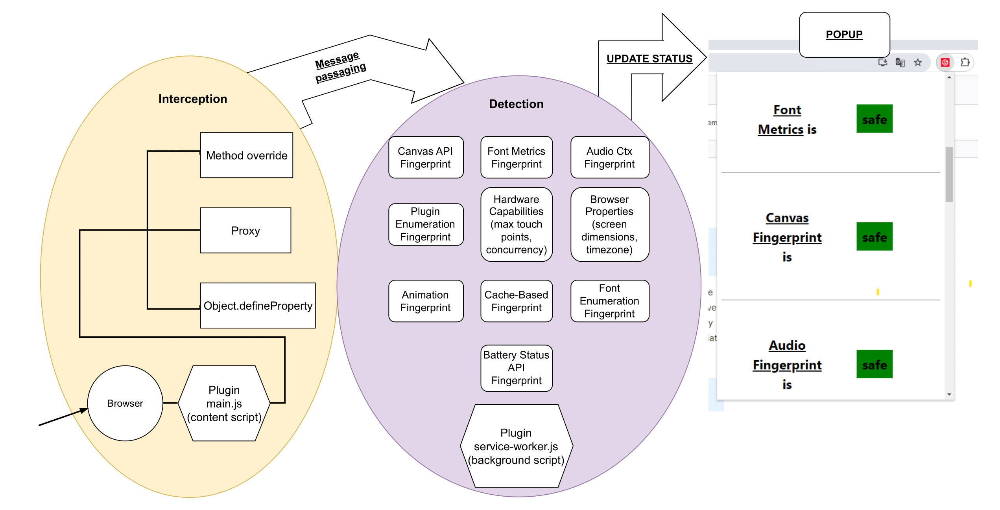

# FINGER - Fingerprint Interception and Notification for Guarding User Rights

FINGER é uma ferramenta desenvolvida como uma extensão para o navegador Google Chrome, com o objetivo de monitorizar e proteger a privacidade dos utilizadores na web. A extensão deteta atividades de fingerprinting, uma técnica utilizada para rastrear os utilizadores através de características únicas do navegador e do sistema, permitindo ao utilizador gerir e bloquear esses rastreadores em tempo real.

## Funcionalidades

- **Intercetação de scripts**: A extensão insere scripts (content scripts) que intercetam e monitorizam métodos JavaScript para detetar fingerprinting.
- **Deteção de fingerprinting**: Monitoriza várias técnicas de fingerprinting, incluindo:
  - Canvas API
  - Font Metrics
  - Enumeração de Plugins
  - Audio Context
  - Battery Status API
  - Fingerprinting baseado em Cache
  - Deteção de propriedades de hardware e do navegador.
- **Alertas ao utilizador**: Quando uma tentativa de fingerprinting é detetada, a extensão notifica o utilizador através de uma interface popup.
- **Bloqueio dinâmico**: A extensão permite ao utilizador bloquear tentativas de rastreamento por redirecionamento através de regras dinâmicas.

## Arquitetura e Fluxo de Trabalho

1. Quando uma página web é carregada, o ficheiro `main.js` é injetado e interceta potenciais atividades de fingerprinting, modificando métodos JavaScript e propriedades de objetos.
2. Eventos de fingerprinting detetados são registados e enviados para o script de plano de fundo (`service-worker.js`).
3. O script de plano de fundo processa os eventos e pode atualizar o estado da extensão ou notificar o utilizador através de um popup.
4. O utilizador pode interagir com o popup para ver detalhes sobre tentativas de fingerprinting e configurar o comportamento da extensão.



## Estrutura de Ficheiros

- **manifest.json**: Ficheiro de configuração principal da extensão que define permissões, scripts a serem injetados e outros metadados.
- **main.js**: Script de conteúdo que interceta tentativas de fingerprinting em páginas web.
- **popup.html**: Interface da extensão que apresenta informações ao utilizador sobre eventos de fingerprinting detetados.
- **popup.js**: Script que gere as interações e exibe as informações no popup.
- **service-worker.js**: Gere processos em segundo plano, incluindo a sincronização do estado, bloqueio dinâmico de rastreamento e monitorização de redirecionamentos maliciosos.

## Tecnologias Utilizadas

- **API de Extensões do Google Chrome**: Utilizada para injetar scripts e gerir as permissões necessárias.
- **JavaScript**: Para intercetar, monitorizar e modificar o comportamento de scripts de fingerprinting.
- **HTML/CSS**: Para a interface gráfica do popup.
  
## Instalação

1. Clone o repositório:
    ```bash
    git clone https://gitlab.engine.capgemini.com/software-engineering/portugal/internal/vortexcolab/browser_plugin.git
    ```
2. Mude de branch:
    ```bash
    git checkout development
    ```

3. Navegue até o diretório do projeto:
    ```bash
    cd browser_plugin
    ```
3. Carregue a extensão no Google Chrome:
    - Abra `chrome://extensions/`.
    - Ative o "Modo de desenvolvedor".
    - Clique em "Carregar sem compactação" e selecione o diretório do projeto.

## Como Contribuir

1. Fork o projeto.
2. Crie uma branch para sua funcionalidade (`git checkout -b feature/nome-da-funcionalidade`).
3. Faça commit das suas alterações (`git commit -am 'Adiciona nova funcionalidade'`).
4. Envie as alterações para o repositório remoto (`git push origin feature/nome-da-funcionalidade`).
5. Abra um Pull Request.

## Licença

vortexcolab

***

# FINGER - Fingerprint Interception and Notification for Guarding User Rights

FINGER is a tool developed as a Google Chrome extension to monitor and protect user privacy on the web. It detects fingerprinting activities, a method used to track users through unique browser and system characteristics, and allows users to manage and block these trackers in real-time.

## Features

- **Script interception**: The extension injects content scripts that intercept and monitor JavaScript methods to detect fingerprinting.
- **Fingerprinting detection**: Monitors various fingerprinting techniques, including:
  - Canvas API
  - Font Metrics
  - Plugin Enumeration
  - Audio Context
  - Battery Status API
  - Cache-Based Fingerprinting
  - Detection of hardware and browser properties.
- **User alerts**: When fingerprinting attempts are detected, the extension notifies the user through a popup interface.
- **Dynamic blocking**: The extension allows users to block tracking attempts via redirection using dynamic rules.

## Architecture and Workflow

1. When a page is loaded, the `main.js` file is injected and intercepts potential fingerprinting activities by overriding JavaScript methods and object properties.
2. Detected fingerprinting events are logged and sent to the background script (`service-worker.js`).
3. The background script processes these events and may update the extension's state or notify the user via a popup.
4. The user can interact with the popup to view details of fingerprinting attempts and configure the extension's behavior.


## File Structure

- **manifest.json**: The main configuration file for the extension, defining permissions, scripts to be injected, and other metadata.
- **main.js**: The content script that intercepts fingerprinting attempts on web pages.
- **popup.html**: The user interface displaying information about detected fingerprinting events.
- **popup.js**: Manages interactions and updates the popup interface.
- **service-worker.js**: Handles background processes, including state synchronization, dynamic blocking of tracking, and monitoring for malicious redirects.

## Technologies Used

- **Google Chrome Extensions API**: Used to inject scripts and handle the necessary permissions.
- **JavaScript**: To intercept, monitor, and modify the behavior of fingerprinting scripts.
- **HTML/CSS**: For the graphical interface of the popup.
  
## Installation

1. Clone the repository:
    ```bash
    git clone https://gitlab.engine.capgemini.com/software-engineering/portugal/internal/vortexcolab/browser_plugin.git
    ```
2. Shift to branch:
    ```bash
    git checkout development
    ```
2. Navigate to the project directory:
    ```bash
    cd browser_plugin
    ```
3. Load the extension in Google Chrome:
    - Open `chrome://extensions/`.
    - Enable "Developer mode".
    - Click on "Load unpacked" and select the project directory.

## How to Contribute

1. Fork the project.
2. Create a new branch for your feature (`git checkout -b feature/feature-name`).
3. Commit your changes (`git commit -am 'Add new feature'`).
4. Push to the branch (`git push origin feature/feature-name`).
5. Open a Pull Request.

## License

vortexcolab
